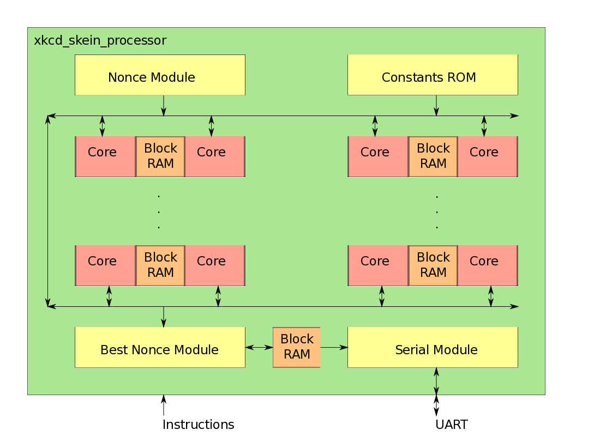

xkcd-skein-fpga
===============
xkcd-skein-fpga is a Verilog HDL implementation of the Skein-1024-1024 hash function for use with Spartan 6 FGPAs

## What is Skein?

Skein is a cryptographic hash function created by Bruce Schneier, Niels Ferguson, and several other people. It was a finalist in the NIST hash function competition to determine the algorithm that will be used for SHA-3. The Keccak hash function ended up winning the competition. Skein-1024-1024 is a specific variant of Skein that uses a 1024-bit state size and a 1024-bit output size. Other state sizes are far more common, namely Skein-256 and Skein-512.

A cryptographic hash function is a mathematical algorithm that takes input data of an arbitrary size and map it to output data of a fixed size. In addition, it is a one-way function. The input data can be used to find the output data, but when only given the output data, the input data can not be found. The only way to find the input data is to do a brute-force search using all possible input data. Another important property of a cryptographic hash function is that a small change to the input data results in a significant change to the output data.

On April Fool's Day 2013, the webcomic XKCD featured a dynamically updated comic based on the three .edu domains with the closest Skein-1024-1024 hash output to a target 1024-bit number. Since hash function outputs are random, matching the target requires an enormous amount of time and/or processing power. Trying to get the closest hash output works like this:

1. Generate a random number (this is often called a nonce).
2. Hash the random number to generate an output.
3. Compare the output to the target number. If the output is the closest number you have to the target, send the random number to the XKCD server.
4. Repeat

This problem is one that is more efficiently solved with parallelism. As long as workers are using unique nonces, they will not be repeating work. GPUs and FPGAs allow the use of several concurrent workers, resulting in faster and more efficient processing.

This problem is an example of proof-of-work, which is the core principle behind Bitcoin mining, as well as most other cryptocurrencies. In the case of mining, miners are hashing a block header and looking for an output that is lower than a certain amount. Doing this requires time and processing power. Bitcoin is actually where my interest in FPGAs began. When FPGA mining became prominent circa 2011, I had no idea what they were. I kept reading more about them and wanted to learn more. Eventually I decided to build this.

## Processor

