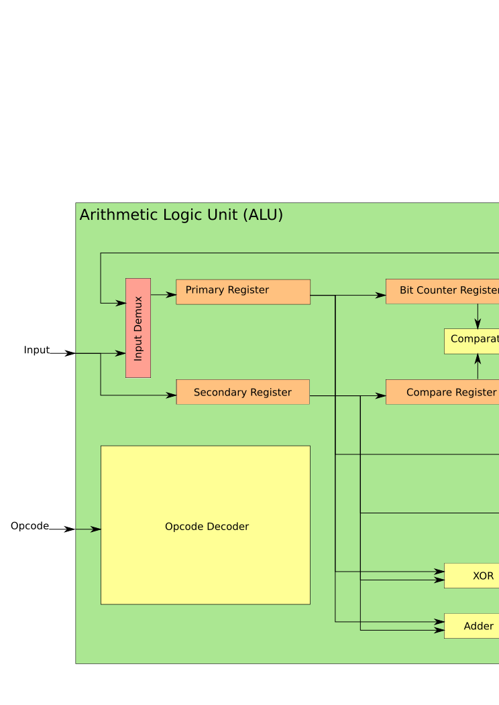

# Arithmetic Logic Unit (ALU)
The ALU is responsible for performing the major arithmetic operations necessary to compute the hash, such as addition, XOR, and bit rotation. It is also responsible for comparing the computed hash value to find the best possible hash.

## Design Requirements
- 64-bit word size
- Addition
- XOR
- Rotate Left
- Bit Counter
- Result Comparison
  - Given the following variables:
    - best_nonce - The nonce used to calculate the best result.
    - best_bits - The number of bits off target for the best computed value.
    - result_nonce - The nonce used to calculate the newly computed hash value.
    - result_bits - The number of bits off target of the newly computed hash value.
  - If result_bits < best_bits:
    - best_nonce = result_nonce
    - best_bits = result_bits
- Pass-through to RAM and main-bus

## Components

### Registers

#### Primary Register
The primary register is 64-bits wide. It differs from the Secondary Register in that it can have its LSB counted by the Bit Counter Register and that it can shift left 1-bit at a time. The 1-bit shift is to support the Rotate operation necessary for Skein hash calculation.

This register allows 16-bit left shifts because the Spartan 6 block RAM that is being used only supports a 16-bit wide data bus.

#### Secondary Register
The Secondary Register is 64-bits wide and is generally used to store an operand for an ALU operation.

This register allows 16-bit left shifts because the Spartan 6 block RAM that is being used only supports a 16-bit wide data bus.

#### Bit Counter Register
The Bit Counter Register is 10-bits wide and serves two functions: bit counting and comparison. To calculate the number of bits off from the XKCD target, the bits must be counted. Subsequently to compare each hash's bits-off-target with the best hash's bits-off-target, this register is used.

#### Comparator Register
Used to store the current best hash-bits-off count to be compared with the hash that was just calculated.

### Combinational

#### Opcode Decoder
Decodes the 4-bit opcode input to control the 12 control bits of the ALU.

#### Comparator
The Comparator finds the lowest value between the Bit Counter Register and the Compare Register and selects the register with the lowest value on the Comparator Demux. In addition, it also selects the corresponding nonce value that goes with each bits-off count. This happens on the Pass-through Demux. Nonce values must be stored in the Primary and Secondary Registers. The comparator is implemented as described [here](https://en.wikipedia.org/wiki/Digital_comparator#Implementation).

#### XOR
64-bit XOR of Primary and Secondary for use in Skein hash calculation

#### Adder
64-bit adder that adds the Primary and Secondary Registers for use in Skein hash calculation.

### Demultiplexers

#### Pass-through Demultiplexer
Has two modes. The first simply selects the Primary Register value and passes it through to the output. This is used to write values to the RAM. The second mode allows the Comparator to select the nonce value of the best hash available.

#### Comparator Demultiplexer
The Comparator Demultiplexer has two modes, the first mode simply selects the Bit Counter value. TODO: This may not be necessary, as the bit count value calculated could just remain here while the best bit count is loaded to the compare register. The second mode allows the Comparator to select the lowest of the Bit Counter Register and the Compare Register and push that value to the Output Demux.

#### Output Demultiplexer
The Output Demultiplexer allows the selection of what goes to the output of the ALU. There are four inputs to this demultiplexer and one output.

#### Input Demultiplexer
The Input Demultiplexer allows the selection of what input goes to the Primary Register. There are two inputs to this demultiplexer, the first is the ALU input and the second is the ALU output. Writing the ALU output value to the Primary Register is important when performing an XOR or Addition operation. The Primary Register is use to rotate the XOR/Addition result so that it can be written to memory 16-bits at a time.

## Operations
| Opcode | Operation                                                    |
| ------ | ------------------------------------------------------------ |
| 0x0    | Write Primary Register                                       |
| 0x1    | Write Primary Register Lower 16-bits                         |
| 0x2    | Rotate Primary and Secondary Register Left 16-bits           |
| 0x3    | Rotate Primary Register Left 1-bit and Increment Bit Counter |
| 0x4    | Write Secondary Register                                     |
| 0x5    | Write Secondary Register Lower 16-bits                       |
| 0x6    | Rotate Secondary Register Left 16-bits                       |
| 0x7    | XOR                                                          |
| 0x8    | Add                                                          |
| 0x9    | Write Bit Counter                                            |
| 0xA    | Write Comparator Register & Compare                          |
| 0xB    | Comparator Nonce Pass-through                                |
| 0xC    | Primary Register Pass-through                                |
| 0xD    | Bit Counter Pass-through                                     |
| 0xE    | Compare                                                      |

## Usage
### Loading Value from RAM
When loading a value shorter than 64-bits, make sure that the upper bits are zeroed. This can be done by writing a zero from the 64-bit Constants ROM to the Primary Register. The Secondary Register does not have this luxury, and zeroing it is much more difficult. Good luck.

Since the Primary and Secondary Registers Rotate at the same time, both registers must be rotated left 16-bits before any writing occurs. This is done so that writing to one register does not corrupt the data stored in the other register. The purpose of making both registers rotate together is to support the Nonce Pass-through instruction. Since it is unknown which register is being passed-through to RAM, both registers are rotated at the same time.

1. Rotate Primary and Secondary Register left 16-bits.
2. Write [Primary/Secondary] Register lowest 16-bits.
3. Rotate Primary and Secondary Register left 16-bits.
4. Write [Primary/Secondary] Register lowest 16-bits.
5. Rotate Primary and Secondary Register left 16-bits.
6. Write [Primary/Secondary] Register lowest 16-bits.
7. Rotate Primary and Secondary Register left 16-bits.
8. Write [Primary/Secondary] Register lowest 16-bits.
### Loading Value from Constants ROM
Constants ROM to ALU input is 64-bit, so there is no need to shift in 16 bits at a time.
1. Write Primary Register
### Addition and XOR
1. Load value from RAM or Constants ROM to Primary Register. See [Loading Value from RAM](#loading-value-from-ram).
2. Load value from RAM to Secondary Register.
3. Perform XOR or Addition, Result is written to Primary Register.
4. Rotate Primary and Secondary Register left 16-bits. First 16-bits are written to RAM.
5. Rotate Primary and Secondary Register left 16-bits. Second 16-bits are written to RAM.
6. Rotate Primary and Secondary Register left 16-bits.Rotate Primary Register left 16-bits. Third 16-bits are written to RAM.
7. Rotate Primary and Secondary Register left 16-bits. Fourth 16-bits are written to RAM.
### Counting Bits
1. Load zero from Constants ROM to Primary Register.
2. Write Bit Counter.
3. Write value from RAM to Primary Register.
4. Count all 64 bits. (Run 0x3 64 times.)
5. Read Bit Counter. (0xD)
### Nonce Comparison
1. Load result_bits from RAM to Primary Register. (Optional: This should already be here when counting bits.) See [Loading Value from RAM](#loading-value-from-ram).
2. Write Bit Counter Register. (Optional: This should already be here when counting bits.)
3. Load result_nonce from RAM to Primary Register.
4. Load best_bits from RAM to Secondary Register.
5. Write Comparator Register.
6. Load best_nonce from RAM to Secondary Register.
7. Compare. Lowest bits off count will be at ALU output.
8. Nonce Pass-through (0xB). Nonce corresponding to lowest bits off will be at ALU output.
### Writing Constants to Memory
1. Load value from Constants ROM to Primary Register.
2. Rotate Primary and Secondary  Register left 16-bits. First 16-bits are written to RAM.
3. Rotate Primary and Secondary  Register left 16-bits. Second 16-bits are written to RAM.
4. Rotate Primary and Secondary  Register left 16-bits. Third 16-bits are written to RAM.
5. Rotate Primary and Secondary  Register left 16-bits. Fourth 16-bits are written to RAM.
### Rotate Left n bits
TODO: The rotate left 16-bit instructions should actually just be implemented in the memory addressing when writing back to RAM.
1. Load value into Primary Register See [Loading Value from RAM](#loading-value-from-ram).
2. Rotate Primary and Secondary Register Left 16-bits. (0x2) Do this `n / 16` times.
3. Rotate Primary Register Left 1-bit. (0x3) Do this `n % 16` times.
4. Read Primary Register. (0xC)

## Control Bits
The ALU has 13 total control bits, shown as follows:

- 3 bits for Primary Register
  - 000: Idle
  - 110: Write lowest 16 bits
  - 111: Write full 64 bits
  - 010: Rotate left 16 bits
  - 001: Rotate left 1 bit
- 2 bits for Secondary Register
  - 00: Idle
  - 01: Rotate left 16 bits
  - 10: Write lowest 16 bits
  - 11: Write full 64 bits
- 2 bits for Bit Counter Register
  - Write
  - Increment
- 1 bit for Comparator Register
  - Write
- 1 bit for Comparator Demux
  - Select Bit Counter Register
    - If HIGH select Bit Counter Register
    - If LOW use Comparator selection.
  - Note: There is another internal bit from the Comparator, this selects the value that is the lowest in the comparator.
- 1 bit for Pass-through demux
  - Select Primary
    - If HIGH select Primary Register
    - If LOW use Comparator selection.
  - Note: There is another internal bit from the Comparator, this selects the value that is the lowest in the comparator. If Compare Register is lowest, select Secondary Register. If Bit Counter Register is lowest select Primary Register
- 2 bits for Output Demux
  - 00: Comparator Demux
  - 01: Pass-through Demux
  - 10: XOR
  - 11: Adder
- 1 bit for Input Demux
  - 0: ALU Input
  - 1: ALU Output

### Opcode Decoding
| Operation                                                    | Opcode | Primary Register | Secondary Register | Bit Counter Register | Comparator Register | Comparator Demux | Pass-through Demux | Output Demux | Input Demux |
| ------------------------------------------------------------ | ------ | ---------------- | ------------------ | -------------------- | ------------------- | ---------------- | ------------------ | ------------ | ----------- |
| Write Primary Register                                       | 0x0    | 111              | 00                 | 00                   | 0                   | X                | X                  | XX           | 0           |
| Write Primary Register Lower 16-bits                         | 0x1    | 110              | 00                 | 00                   | 0                   | X                | X                  | XX           | 0           |
| Rotate Primary and Secondary Register Left 16-bits           | 0x2    | 010              | 01                 | 00                   | 0                   | X                | 1                  | 01           | 0           |
| Rotate Primary Register Left 1-bit and Increment Bit Counter | 0x3    | 001              | 00                 | 01                   | 0                   | 1                | X                  | 00           | 0           |
| Write Secondary Register                                     | 0x4    | 000              | 11                 | 00                   | 0                   | X                | X                  | XX           | 0           |
| Write Secondary Register Lower 16-bits                       | 0x5    | 000              | 10                 | 00                   | 0                   | X                | X                  | XX           | 0           |
| Rotate Secondary Register Left 16-bits                       | 0x6    | 000              | 01                 | 00                   | 0                   | X                | X                  | XX           | 0           |
| XOR                                                          | 0x7    | 111              | 00                 | 00                   | 0                   | X                | X                  | 10           | 1           |
| Add                                                          | 0x8    | 111              | 00                 | 00                   | 0                   | X                | X                  | 11           | 1           |
| Write Bit Counter                                            | 0x9    | 000              | 00                 | 10                   | 0                   | X                | X                  | XX           | 0           |
| Write Comparator Register & Compare                          | 0xA    | 000              | 00                 | 00                   | 1                   | 0                | X                  | 00           | 0           |
| Comparator Nonce Pass-through                                | 0xB    | 000              | 00                 | 00                   | 0                   | X                | 0                  | 01           | 0           |
| Primary Register Pass-through                                | 0xC    | 000              | 00                 | 00                   | 0                   | X                | 1                  | 01           | 0           |
| Bit Counter Pass-through                                     | 0xD    | 000              | 00                 | 00                   | 0                   | 1                | X                  | 00           | 0           |
| Compare                                                      | 0xE    | 000              | 00                 | 00                   | 0                   | 0                | X                  | 00           | 0           |
