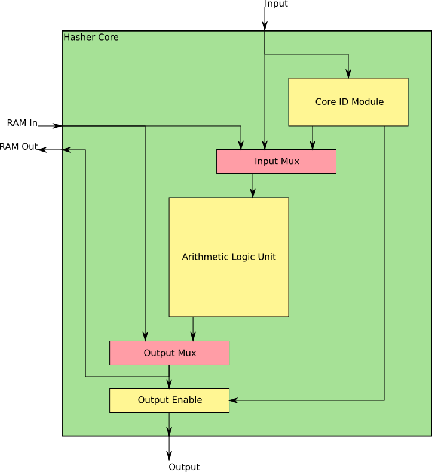

# Hasher Core

The Hasher Core is capable of doing all operations necessary to compute a hash value. It can be used in parallel with other Hasher Cores to increase hashing power.

## Components

### Core ID Module
See Core ID Module documentation.

### Arithmetic Logix Unit
See ALU documentation.

### Input Mux
Selects between using Core Input, RAM Output, or Core ID as the input to the ALU.

### Output Mux
Selects between passing the RAM or the ALU Output out to the Core Output.

### Output Enable
Allows the Output to the Main Bus to be toggled. When disabled, Core Output is high-impedance.

## Control Signals
The Core ID module has 9 control bits.

- Core ID Module - 2 bits
  - Save Selection
  - Output Enable (Chip Level)
- Input Mux - 2 bits
  - 00: Core Input
  - 01: RAM Output
  - 10: Core ID
- ALU - 4 bits
  - Opcode
- Output Mux - 1 bit
  - 0: ALU Output
  - 1: RAM Output
