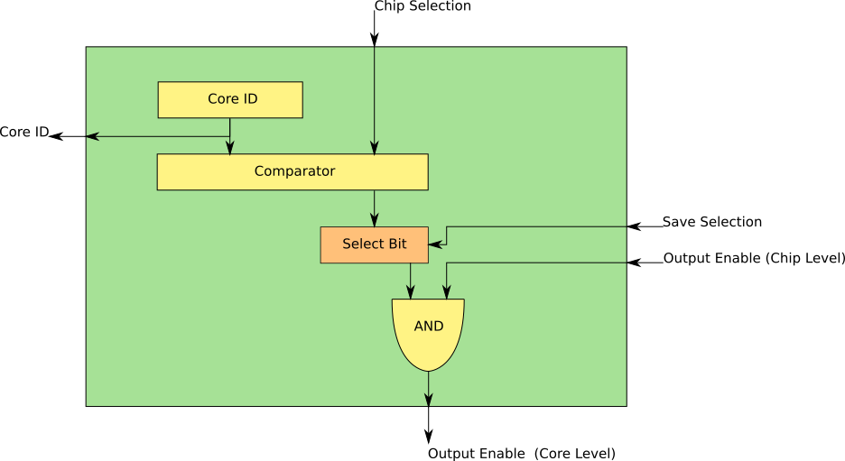

# Core ID Module

The Core ID Module serves two purposes:

1. The Core ID is used to seed the hash function to ensure that each core is performing a unique hash function.
2. The Core ID is used as a Chip Select so that only one core is driving the Main Bus at one time.

The Core ID maintains an 24-bit value that is unique to each core. This value should already be Base64 encoded, so that inputs to the hash function are all printable characters. Since the values are Base64 encoded there will only be 18-bits of uniqueness for the Core ID. 18-bits will allow for 262144 different cores which should be enough for current FPGAs, even for a Xilinx Artix7.

## Components

### Core ID
A 24-bit value stored in combinational-logic at synthesis-time. It should be a Base64 encoded integer to ensure that all inputs to the hash function correspond to a printable ASCII string. All instances of the Core ID Module within a chip should have a unique Core ID.

### Comparator
If Core ID and Chip Selection are the same, output is HIGH. Otherwise, it is LOW.

### Select Bit
A 1-bit register that is used to Select a Core ID Module. Because all Core IDs are unique at a chip-level, only one Select Bit should be high at one time.

### AND
Used to turn the chip-level Output Enable into an Output Enable that is only valid for one Core.

## IO Signals

### Core ID
This is a 24-bit Base64 encoded value that is used as an input to the hash function.

### Chip Selection
This is a 24-bit input used to select the chip. If the Core ID and the value provided through Chip Selection are equal, the comparator output will be high.

### Save Selection
Save the Comparator output bit.

### Output Enable (Chip Level)
This is a chip-level signal used to select exactly one Core ID module. It propagates to all Core ID Modules, but only Core ID Module should have a Select Bit that is high.

### Output Enable (Core Level)
This routes to the Core that the Core ID is a part of. It is used to enable the Core so that it outputs to the Main Bus.
