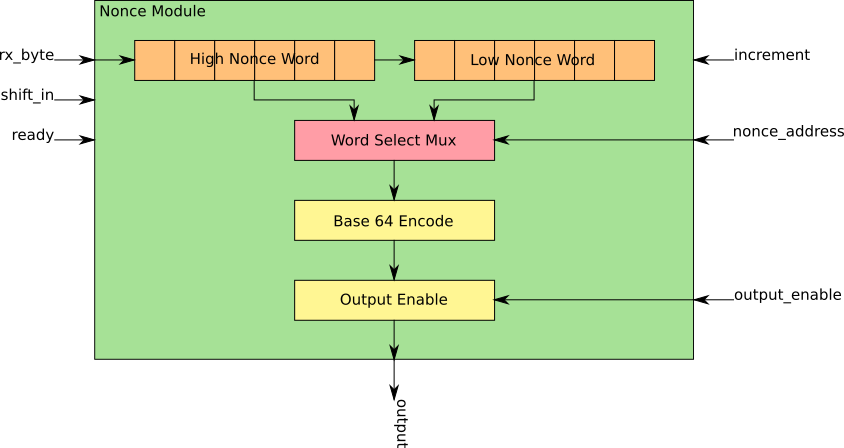

# Nonce Module

The Nonce Module provides a random seed for the hash function, so that the same work is never repeated. The [nonce](https://en.wikipedia.org/wiki/Cryptographic_nonce) is a 96-bit, or 12 byte, random number that is generated by the machine hosting the FPGA and is transmitted via serial to the FPGA during its initialization. After each computation of a hash value, the nonce value is incremented and the hash function is ran again.

## Encoding
A design goal of the overall chip is that hash input values be entirely ASCII strings. To accomplish this, the 96-bit nonce value is [base64](https://en.wikipedia.org/wiki/Base64) encoded. The encoded value is 128-bits long, or two 64-bit words. These two words are used as inputs to the hash function.

## Initialization
A host machine will generate a 96-bit nonce value. This 12-byte nonce value will then be sent to the FPGA via UART and shifted into the Nonce Module, least-significant byte first (little endian).

## Entropy
The nonce will provide 96-bits of entropy, or 7.92 x 10^28 unique hashes. With a hashing rate of 1.5 MH/s it will take 1.67 x 10^15 years to calculate all of these hashes. In approximately 7.6 x 10^9 years the Earth will likely be destroyed by an expanding red giant Sun.

## IO Signals

### rx_byte
Byte from UART module.

### shift_in
Shifts in a byte to the nonce register. When shifting in a full nonce it must be done little endian.

### ready
Enables the increment signal. This is so that the nonce register will not be corrupted while it is being shifted in.

### increment
When high, this will add one to the nonce register.

### nonce_address
Selects between the high and low value of the nonce register. 0 is Low and 1 is High.

### output_enable
The Nonce Module will likely talk on a tri-state bus and will not be the only module capable of driving the bus. When nonce output is not needed, the Nonce Module outputs will be set to high-Z.
