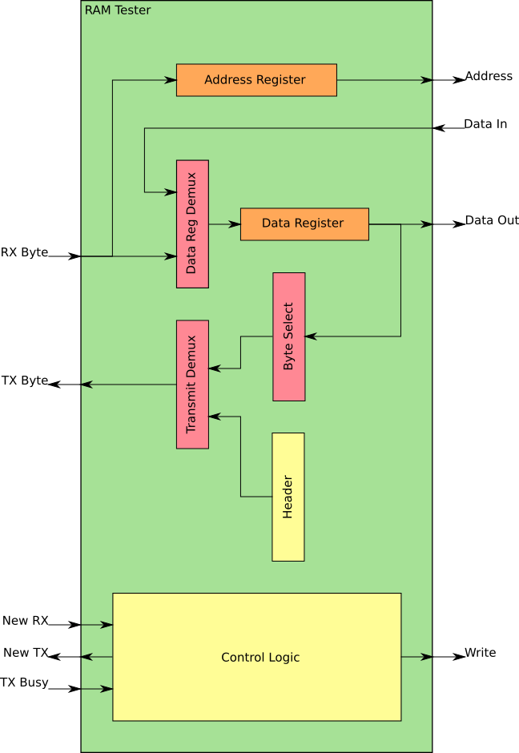
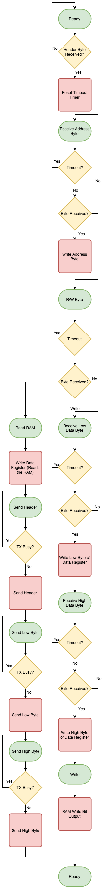

# RAM Tester
This module is used to test RAM on real FPGA hardware. It can test both the Xilinx Spartan 6 Block RAM IP core and the `block_ram.v` that I've implemented. Verification of both these RAMs is important because, to my knowledge, the Xilinx IP cannot be used with Verilator. If both modules are functionally identical, `block_ram.v` can be used for Verilator simulation.

**TODO:** The RAM tester module needs to know the clock rate of the FPGA in order to find out the max value of the timeout timer.

## Components

### Address Register
8-bits wide. Used to store the address used for memory access. It is written via UART.

### Data Register
16-bits wide. Used to store either the value read from the RAM or the value that will be written to the RAM. The UART writes this register in the case of a RAM write. Since the UART is only one byte wide, the data register has two write bits. One for the high byte and one for the low byte.

### Data Register Demux
Selects between the 8-bit RX byte and the 16-bit data word coming from the RAM. The RX byte is doubled on the bus, meaning it is on both [15:8] and [7:0] of the output.

### Byte Select Demux
Selects between the high and low byte of the Data Register output. This is used to send the 16-bit data read from the RAM back to the UART, one byte at a time.

### Transmitter Demux
Selects between the Byte Select Demux output and the Header Constant.

### Header Constant
A constant 8-bit output that is used to select what header is used by the serial interface.

### Control Logic
Contains a state machine and a UART timeout timer for controlling the overall module.

## Control Bits
The RAM tester has 5 internal control bits.

- Address Register
  - Write
- Data Register
  - Write High Byte
  - Write Low Byte
- Data Register Demux
  - Select
    - 0: RX Byte
    - 1: Data Word
- Byte Select Demux
  - Select
    - 0: Low Byte
    - 1: High Byte
- Transmitter Demux
  - Select
    - 0: Data Register Demux
    - 1: Header

## State Machine

### Outputs
- UART Signals
  - new_tx_data
- RAM Signals
  - write
- Internal Control Signals
  - address_register_write
  - data_register_write_low
  - data_register_write_high
  - data_register_demux
  - byte_select_demux
  - transmitter_demux
- Timeout Timer
  - timeout_timer_reset

### State Specific Outputs
- Ready
  - Mealy
    - timeout_timer_reset
    - next_state
- Receive Address Byte
  - Mealy
    - address_register_write
    - next_state
- Receive R/W Byte
  - Mealy
    - next_state
- Receive Low Data Byte
  - Mealy
    - data_register_write_low
    - next_state
  - Moore
    - data_register_demux
- Receive High Data Byte
  - Mealy
    - data_register_write_high
    - next_state
  - Moore
    - data_register_demux
- Write RAM
  - Moore
    - write
    - next_state (implemented as Mealy)
- Read RAM
  - Moore
    - data_register_demux
    - data_register_write_low
    - data_register_write_high
    - next_state (implemented as Mealy)
- Send Header
  - Mealy
    - new_tx_data
    - next_state
  - Moore
    - transmitter_demux
- Send Low Data Byte
  - Mealy
    - new_tx_data
    - next_state
  - Moore
    - transmitter_demux
    - byte_select_demux
- Send High Data Byte
  - Mealy
    - new_tx_data
    - next_state
  - Moore
    - transmitter_demux
    - byte_select_demux
