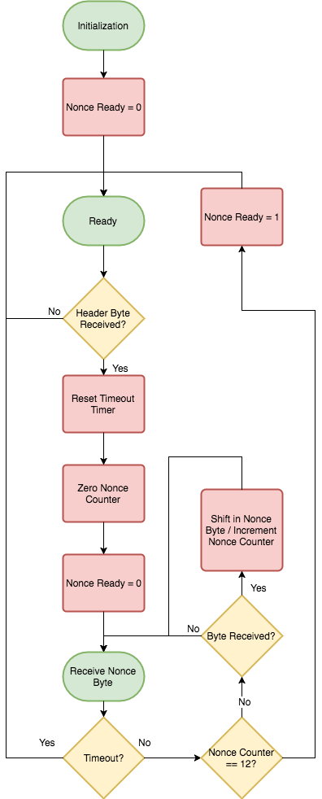
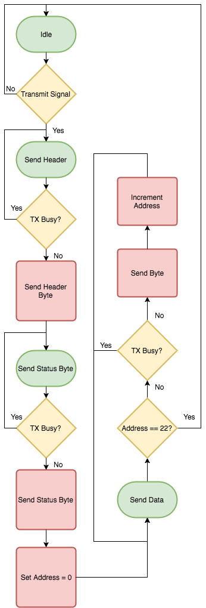

# Serial Module

The Serial Module sends and receives data to the host machine. It shares a
block RAM with the Best Nonce Module. Both modules have ready signals that lock
shared data.

The Serial Module is broken down into two sub-modules, one for the receiver and
one for the transmitter.

## Receiver IO Signals

### rx_byte_i
Byte received from UART.

### new_rx_byte_i
rx_byte_i is a newly received byte.

### nonce_byte_o
Byte to be shifted into Nonce Module.

### nonce_shift_in_o
Shift byte into Nonce Module.

### nonce_ready_o
Nonce is done being shifted in and is ready for use.

## Transmitter IO Signals

### tx_byte_o
Byte to transmit over UART.

### new_tx_byte_o
Notifies serial transmitter that a new byte is ready to send.

### tx_busy_i
Serial transmitter is busy sending a byte.

### ram_i
8-bit output from block RAM.

### ram_address_o
5-bit RAM address select

### status_i
8-bit status register input

### transmit_i
Transmit command bit. When this goes high the serial transmitter will start
transmitting.

## Receiver State Machine

## Transmitter State Machine

