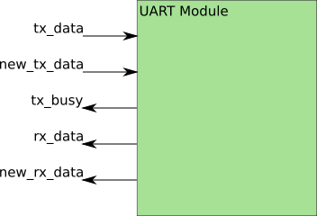

# UART Module
The Mojo AVR interface provides UART (Universal Asynchronous Receiver/Transmitter) communication with the host machine. Embedded Micro provides a module, `avr_interface.v` that handles a lot of the communication with the AVR. Byte-level UART IO is implemented by this module. For the sake of simplifying the overall design, the UART module referred to in this document is the `avr_interface.v`, except we are only concerned with the subset of `avr_interface.v` signals that pertain to UART.

## UART Module Signals (subset of mojo avr_interface.v)
- Transmit
  - tx_data - 8-bits. The byte that is to be sent over UART. Needs only to be valid when new_tx_data is high, as that is the only time that it is written to the UART modules internal register.
  - new_tx_data - Set this to high when there is new data to be sent. Note: This can go high in the same clock cycle that tx_data is sent.
  - tx_busy - This is high when the UART is currently in the process of sending a byte. This exists to prevent data loss.
  - tx_block - When this is high, it prevents a new byte from being transmitted. It does not stop a byte that is already in progress. Note: This should be hooked up to avr_rx_busy in mojo_top.v. Since it is for AVR-to-FPGA communication, and not for use by HDL it can be ignored most of the time.
- Receive
  - rx_data - 8-bits. The byte that was received over UART. Valid when new_rx_data is high.
  - new_rx_data - This is high when the UART module has received a byte. The byte is available at rx_data.
